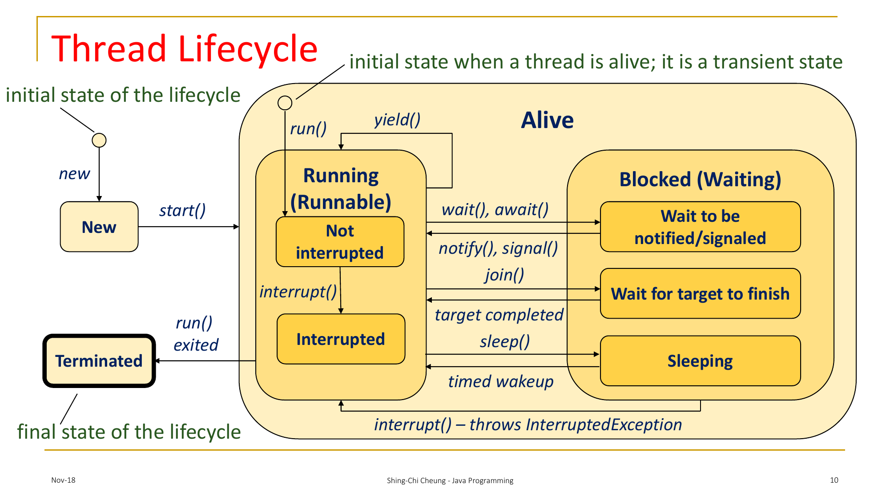
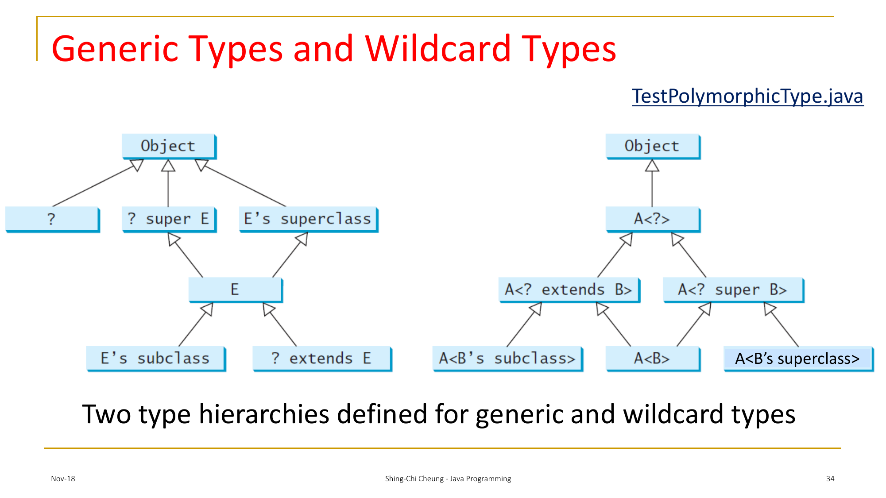

# COMP3021 Notes

## Chapter 1: Introduction to Java Programming

### Type Conversions

#### Primitive Types

- `double d = 1;`
    - Valid - `double` has a larger numeric range than `int`
    - Defined as *Widening Primitive Conversion*
- `int i = 1.0;`
    - Invalid - `int` has a smaller numeric range than `double`
    - Use `int i = (int) 1.0;` for explicit *Narrowing Primitive Conversion*
- `boolean b = 1;`
    - Invalid - `boolean` is incompatible with `int`
- `int i = true;`
    - Invalid - See above
- `char c = 1;`
    - Valid - `char` is a numeric type
    - Type of *Narrowing Primitive Conversion*
- `int i = 'a';`
    - Valid - Casting from an integral type to another integral type
    - Type of *Widening Primitive Conversion*
- `Integer.MAX_VALUE + 1;`
    - Valid - Integral overflow will lead to 2's-complement wraparound

#### Reference Types

Given the following class definitions:


```java
class A {}
class B extends A {}
```

- `A a = new A();`
    - Valid - Same Type
    - Defined as *Identity Conversion*
- `B b = new B();`
    - Valid - Same Type
    - Type of *Identity Conversion*
- `A a = new B();`
    - Valid - `A` is a superclass of `B`
    - Defined as *Widening Reference Conversion*
- `B b = new A();`
    - Invalid - `B` is a subclass of `A`: Cannot "expand" `A` into `B`
    - Defined as *Narrowing Reference Conversion*
    - Compiler is able to deduce statically (i.e. during compile-time) that this
    conversion is impossible

### Dynamic Binding
- All Java references are dynamically binded
- Given a superclass reference `A`, if the original object is type `B extends A`
and `B` contains overriding methods, `A.method()` will preferentially invoke
`B.method()`.

```java
class A {
    public void f() { System.out.println("A.f()"); }
}

class B {
    @Override
    public void f() { System.out.println("B.f()"); }
}

public class Main {
    public static void main(String[] args) {
        new A.f();  // invokes A.f()
        new B.f();  // invokes B.f()

        ((A) new B()).f();  // still invokes B.f(), since it is a B reference
    }
}
```

## Chapter 2: Objects and Classes

### `java.lang.Object`

All Java classes (except `java.lang.Object`) inherits from `java.lang.Object`.

See appendix.

### Instance vs Static

- Instance variables are exclusively owned by objects
- Instance methods can only be invoked with an object reference\*
- Static variables are owned by the class
- Static methods can be invoked anywhere\*

\*: Subject to method visibility

```java
public class Main {
    private int ii = 0;
    private static int si = 10;

    private void im() { System.out.println("Main.im()"); }
    private static void sm() { System.out.println("Main.sm()"); }

    public static void main(String[] args) {
        System.out.println(ii);  // invalid - ii is an instance variable
        System.out.println(si);  // valid - si is a static variable
        im();  // invalid - im() an instance method
        this.im();  // invalid - `this` is undefined in a static context
        sm();  // valid - sm() is a static method
        this.sm();  // invalid - `this` is undefined in a static context

        var m = new Main();
        System.out.println(m.ii);  // valid - accessing an instance variable via an object
        System.out.println(m.si);  // valid - si is a static variable
        m.im();  // valid - accessing an instance method via an object
        m.sm();  // valid - sm() is a static method
    }
}
```

### `this` keyword

Used to explicitly access instance/static variables of a class.

```java
public class Main {
    int i = 0;

    Main(int i) {
        System.out.println(i);  // accesses the constructor parameter `i`
        System.out.println(this.i);  // accesses the instance variable `i`
    }
}
```

### Default initialization

All class members will be default-initialized by:

- Primitive Type: Value equivalent to numeric 0
- Reference Type: `null`

```java
public class Main {
    int i;  // default-init to 0
    double d;  // default-init to 0.0
    char c;  // default-init to `\u0000`
    boolean b;  // default-init to false
    String s;  // default-init to `null`
    Exception e;  // default-init to `null`
}
```

All local variable will **NOT** be default-initialized by any means.
Any use of uninitialized variables will result in a compilation error.
```java
public class Main {
    public static void main(String[] args) {
        int x;
        System.out.println(x);  // compilation error
    }
}
```

### Primitives vs References

```java
public class Main {
    public static void main(String[] args) {
        int x = 1;  // x is a variable of a primitive data type `int`
        String s = new String();  // s is a variable of a reference data type `String`

        int j = x;  // j = 1, x = 1. effectively "copies" the value
        String t = s;  // `t` now "references" the same object as `s`

        j = 10;  // x retains the value of `1`
        t = "abc";  // since `s` and `t` references the same object, that
                    // object will have a value of "abc"
    }
}
```

### Default Constructor

By Java Language Specifications, a default constructor will be generated iff:

- Class does not contain any constructor declarations
- Superclass is either `Object`, or superclass constructor is accessible **AND**
takes 0-arguments **AND** has no `throws` clause

Properties:

- Same access modifier as the class
- Has 0 formal parameters
- Has no `throws` clause
- Has either:
    - An empty body **iff** the superclass is `Object`
    - A body of `super();` otherwise

### Visibility Modifiers

Accessibility of a class, method or variable is always determined during
compile-time.

- `public` (Most Lax)
    - Class/Method/Variable is accessible from any package
- `protected`
    - Class/Method/Variable is accessible from the same package, and the class's
    subclasses
- No modifier (package-access)
    - Class/Method/Variable is accessible from the same package
- `private` (Most Tight)
    - Class/Method/Variable is not accessible outside the class

```java
// assume these classes are in the same file
public class C {
    public void pubF() { System.out.println("C.pubF()"); }
    protected void proF() { System.out.println("C.proF()"); }
    void paF() { System.out.println("C.paF()"); }
    private void priF() { System.out.println("C.priF()"); }
}

public class A {
    void f() {
        C c = new C();
        c.pubF();
        c.proF();
        c.paF();
        c.priF();  // invalid. priF is private within C
    }
}
```
\*: Same applies to static methods.

### Parameter-Passing

- All primitives will pass a variable by "copy"
    - Value is copied from the actual parameter into the function
- All references will pass a variable by "reference"
    - Reference to the object will be copied into the function

### Arrays and `ArrayList<E>`

- Arrays are Objects (`T[] instanceof Object` is `true`)
- Initialization
    - Primitive Arrays: Default-Initialized
    - Reference Arrays: Null-Initialized
- Reference Widening of Arrays are allowed:

```java
// Note: Integer extends Number
Integer[] i = new Integer[10];
Number[] n = i;  // valid
```

- `ArrayList<E>` are variable-size arrays
    - Type parameter `E` **MUST** be a class, not a primitive
    - Reference Widening forbidden

```java
ArrayList<Integer> i = new ArrayList<>();
ArrayList<Number> wrongN = i;  // invalid. different generic parameters
ArrayList<Number> rightN = new ArrayList<>(i);
```

- `Array`-`ArrayList` Conversion:

```java
String[] array = {"a", "b", "c"};
ArrayList<String> alist = new ArrayList<>(Arrays.asList(array));

String[] newArray = new String[alist.size()];
list.toArray(alist);
```

### Mutability

- Immutable Object: Object whose content cannot be changed after construction
    - An object (and class) is immutable **iff** there are no ways to modify
    instance variables, or the member variables of any reference instance
    variables
    - All member variables must have `private` accessibility
    - All accessors ("getters") must also return references to immutable objects

### Common Pitfalls

- Default Constructor != No-Argument Constructor
- Static Methods == Class Methods
- Visibility modifiers **do** apply to classes

## Chapter 3: String

### Basic Properties

- String Construction
```java
new String();  // creates an empty String
new String("Hello World!");  // **explicitly** creates a new `String`
"Hello World";  // (may) create a new `String`
```
- String Immutability
```java
String s = new String("Hello World");  // new object created
s = "Bye World!";  // another new object created
```
- Interned String
```java
String s = new String("Hello World");  // new object created
s = "Bye World!";  // another new object created
s = "Hello World";  // reuses "Hello World" object
```

### Comparisons, Accessors

See appendix.

### String-Number Conversions

- Number-to-String: `String.valueOf(Object)` (and other primitive overloads)
- String-to-Integer (applies to other classes)
    - Primitive: `Integer.parseInt(String)`
    - Reference: `Integer.valueOf(String)`

### Numbers: Reference-Primitive Conversions

- Reference-to-Primitive: `T.intValue()` where `T extends Number`
    - See Appendix for list of functions
- Boxing and Unboxing is automatic

## Chapter 4: Inheritance

### Construction

- Superclass Constructor invoked in one of the following ways:
    - Explicit Invocation: `super(...);`
    - Implicit Invocation: If `super(...);` is not explicitly stated in the
    constructor. Will implicitly call no-arg constructor.
- Constructors can be chained/delegated
- `this(...)` and `super(...);` must be first statement in constructor

### `super` Keyword

- Refers to directly inherited superclass
    - `java.lang.Object` < `java.lang.Number` < `java.lang.Integer`
    - `super` of `Integer` is `Number`
- Can invoke superclass constructor (`super();`)
- Can invoke superclass method (`super.f();`)

### Inheritance and Overriding

- Subclasses can only inherit from one class
- Private instance methods cannot be overriden
- Static methods can be inherited, but not overriden (method hiding)
- Subclasses can "hide" superclass member variables

### Binding

- Compile-Time: Finds a matching method to invoke
- Run-Time: Dynamically bind the correct subclass method
- `instanceof` operator: Checks if a variable is an instance of a clas

### Visibility in Inheritance

- Accessibility can only be relaxed, not tightened
- Applies both to inherited instance methods and static methods

### `final` Keyword

- `final class` cannot be inherited from
- `final` method cannot be overriden
- `final` variable cannot be rebinded to other references

### Instance Initialization

- Field-init and IIBs (instance init-blocks) are initialized first, according
to order of appearence

```java
class A {
    public A() {
        // (4)
    }

    int i = 0;  // (1)

    {
        // (2)
    }

    String s;  // (3)
}
```

### Static Initialization

- Same as Instance Initialization, but SIBs (static init-blocks) have static
keyword before the block

## Chapter 5: Exceptions & File I/O

### General Rules

- Except for `RuntimeException`, all `Throwable` are checked exceptions
- All checked exceptions must be caught or declare to be thrown by the `throws`
clause
    - Overriden methods must either throw the same exceptions, subclass(es) of
    the declared exception, or no exceptions
    - If method does not contain a `throws`clause, overriden methods cannot
    throw checked exceptions
    - Unchecked exceptions do not matter

### `try`-`catch`-`finally`

- Enclose everything that can `throw` in the `try` block
- Handle exceptions in the `catch` block
    - No mandatory order in which exceptions to catch first
    - Generally: Specific exceptions before general exceptions

```java
try {
    throw new FileNotFoundException();
} catch (Exception e) {
    // will always run
} catch (FileNotFoundException fe) {
    // will never run
}
```

- Clean up resources in the `finally` block
    - Guaranteed to be executed before exiting the `try`-`catch` block
- Alternative: `try`-with-resources
    - Class must implement `java.lang.AutoCloseable`

```java
try (Scanner sc = new Scanner(new File(""));) {
    // use scanner
} catch (FileNotFoundException fe) {}
```

### Assertions

- assert expression: `assert booleanExpression : "Message if false";`
    - Throws `AssertionError` if assertion fails
    - Use `-ea` flag when launching JVM

### File I/O

- `File` class: Abstraction for a file/directory
- `PrintWriter` class: For writing into a file
- `Scanner` class: For reading from a file

## Chapter 6: Interfaces

### Abstract Method

- Always has empty body
- Concrete subclasses must override before use

### Abstract Class

- Can contain both abstract and concrete methods
- Cannot contain `private abstract` methods
- Cannot be instantiated
- Can contain constructors
- Can be inherited from a concrete superclass
- Can have no abstract methods or concrete methods
- Can override a concrete method with an `abstract` one

### Interfaces

- All instance methods implicitly `public abstract`, except
    - `default` method: `abstract` method with a default implementation
    - `static` method
    - `private` method
- All non-`private` methods is implicitly `public`
- All fields are implicitly `public static final`
- Static methods are allowed, no overriding required
- Cannot contain instance fields

#### `Comparable<E>`

- Interface that implements `int compareTo(E)`

#### `Cloneable`

- Interface that declares a class to be cloneable
    - i.e. Class can invoke `Object.clone()`
- `Object.clone()` must be explicitly set to `public` visibility

### Nested Class

- Can access everything the superclass can access
- Superclass can access everything the inner class can access
- Static Nested Class
    - Static class within a class
- Instance Nested Class
    - Instance class within a class
    - Requires an instance of the outer class to instantiate

```java
class Outer {
    void f() {
        System.out.println(new Inner().i);
        System.out.println(new InnerStatic().is);
    }

    static void sf() {
        System.out.println(new Inner().i);  // illegal
                                            // new Inner() requires a reference
                                            // to Outer.this, but this function
                                            // is under static context
        System.out.println(new InnerStatic().is);
    }

    class Inner {
        // instance nested class
        int i = 1;
    }
    static class InnerStatic {
        // static nested class
        int is = 2;
    }
}
```

### Local & Anonymous Class

- Local Class
    - Classes within a method
    - Cannot have static members or visibility modifiers
    - Confined to scope of method
- Anonymous Class
    - Local class, but without a name
    - Used to implement **ONE** interface or class

```java
public class Main {
    public static void main(String[] args) {
        class Local {
            Local() {}

            void print() { System.out.println("I'm a local class"); }
        }

        // instantiating a local class
        new Local().print();

        // instantiating AND using a local class
        new Object() {
            void print() { System.out.println("I'm an anonymous class"); }
        }.print();
    }
}
```

- Can access effectively-final local variables
    - Variables that are not mutated throughout the scope it is declared in

```java
public class Main {
    public static void main(String[] args) {
        int i = 0;

        new Object() {
            void incre() {
                i++;  // illegal, since trying to mutate an effectively-final var
            }
        }.print();

        i++;  // illegal, since `i` is not effectively final
    }
}
```

## Chapter 7: GUI Programming

### Basic Structure of JavaFX

- Stage (`javafx.stage.Stage`)
  - Top-level Container (i.e. window)
- Scene (`javafx.scene.Scene`)
  - Container carrying nodes
- Node (`javafx.scene.Node`)
  - Specifies a component of the scene

### Sample

```java
public class Main extends javafx.application.Application {
    @Override
    public void start(Stage primaryStage) {
        var root = new HBox();
        // add all children using root.getChildren().add(Node);

        var scene = new Scene(root, 300, 100);
        stage.setScene(scene);
        stage.show();
    }

    public static void main(String[] args) {
        Main.launch(args);
    }
}
```

### Application Lifecycle

1. Constructs new instance of `? extends Application`
2. Invokes `Application.init()`
3. Creates `JavaFX Application Thread`, and invokes `Application.start()`
4. Waits for application to finish, by:
    - `Platform.exit()`
    - No application windows exist
5. Invokes `Application.stop()`

- `Application.start()` is `abstract`
- Always use `Platform.exit()`. `System.exit(int)` does not invoke `Application.stop()`

### Commonly Used Layout Panes

| Class | Description |
| ----- | ----------- |
| `Pane` | Base class for layout panes. |
| `StackPane` | Places nodes on top of each other in the center of pane. |
| `FlowPane` | Places nodes horizontally/vertically adjacent to each other. |
| `GridPane` | Places nodes in cells in a 2D grid. |
| `BorderPane` | Places nodes in top/right/bottom/left/center regions. |
| `HBox` | Places nodes in a single row. |
| `VBox` | Places nodes in a single column. |

### JavaFX Coordinate System

- Origin (0, 0) at top-left corner
- X-coordinate goes from left (`0`) to right (`w`)
- Y-coordinate goes from top (`0`) to bottom (`h`)

### JavaFX Binding Properties

- Allows target object to be bound to a source object
- Updates target object when source object's property is changed
- `circle.centerXProperty().bind(pane.widthProperty().divide(2));`
    - Source Object: `pane.widthProperty().divide(2)`
    - Target Object: `circle.centerXProperty()`
    - When `pane.widthProperty()` is changed, updates `circle.centerXProperty()`

## Chapter 8: Event-Driven Programming and Animations

### Event Handling Example

```java
class Button1Handler implements EventHandler<ActionEvent> {
    @Override
    public void handle(ActionEvent e) {
        // handle
    }
}

public void start(Stage primaryStage) {
    // using class
    var button1 = new Button("Button 1");
    button1.setOnAction(new Button1Handler());

    // using anon class
    var button2 = new Button("Button 2");
    button2.setOnAction(new EventHandler<ActionEvent>() {
        @Override
        public void handle(ActionEvent e) {
            // handle
        }
    });

    // using lambda
    var button3 = new Button("Button 3");
    button3.setOnAction(e -> {
        // handle
    });
}
```

### Inner Classes

- "Non-static Nested Class"
- Advantages
    - Structural encapsulation
    - Able to reference fields and methods in the outer class(es)

#### Example

```java
public class Outer {
    int x = 0;

    public void mutate() { x++; }

    public class Inner {
        public int get() { return x; }
    }
}

void f() {
    var o = new Outer();

    var i1 = o.new Inner();
    System.out.println(i1.get());  // 0

    o.mutate();

    var i2 = o.new Inner();
    System.out.println(i1.get());  // 1
    System.out.println(i2.get());  // 1
}
```

#### Properties

- Compiled into `<outer class>$<inner class>.class`
    - `Outer$Inner.class`
- Inner classes depend on outer classes, and must be constructed via an outer
class instance
- Cannot delare:
    - Static initializers
    - Member interfaces
    - Static variables, except compile-time constants

### Static Nested Classes and Interfaces

- Often used as types
    - `OuterClass.StaticNestedClass v = null`
- Can be used to create instances
    - `new OuterClass.StaticNestedClass();`
- Nested interfaces are implicitly `static`
    - `OuterClass.NestedInterface v = null;`

### Anonymous Inner Class

```java
void f() {
    new Superclass(<ctor-param-list>) {
        // implement and override methods
    }
}
```

- Always implements an interface or extends an superclass
- Has a default constructor, invoking the superclass constructor
    - JLS 15.9.5.1: *An anonymous class cannot have an explicitly declared constructor.*
    - Use Instance Initializer Block for custom initialization
- Always uses superclass constructor with matching constructors
- Compiled into `OuterClassName$n.class`
    - `n`: Arbitary number to distinguish anonymous classes

### Lambda Expressions (Part 1)

- Syntax:
    - `(<type1> <param1>, <type2> <param2>, ...) -> <expression>`
    - `(<type1> <param1>, <type2> <param2>, ...) -> { /* statements */ }`
    - Can omit brackets if one argument
    - Data type can be declared or inferred

### Single Abstract Methods

- Interfaces with only one abstract method
- Can be implemented with lambda expression
- Example (`javafx.event.EventHandler<T>`):

```java
package javafx.event;

import java.util.EventListener;

@FunctionalInterface
public interface EventHandler<T extends Event> extends EventListener {
    void handle(T event);
}
```

### MouseEvent and KeyboardEvent

See appendix.

### Listen for Observables

- Able to add a listener on `Observable`s
- All binding properties implements `javafx.beans.Observable`
    - Not to be confused with `java.util.Observable<T>` \:(

```java
void f() {
    Observable i = new SimpleIntegerProperty();
    i.addListener((Observable o) -> { /* handle changes here */ });
}
```

### Notes

- If you are not sure what thread your method will be running on, use
`Platform.runLater(Runnable runnable)` on any UI updates

## Chapter 9: Multithreaded Programming

### How to Create Tasks and Threads

```java
// (1) implements Runnable
class TaskClass implements Runnable {
    public TaskClass() {
        // (2): Define constructor
    }

    @Override
    public void run() {
        // (3): Override Runnable.run()
    }
}

class Main {
    public void f() {
        // (4): Create new instance of Runnable
        var task = new TaskClass();

        // (5): Create new instance of Thread
        var thread = new Thread(task);

        // (6): Start the thread
        thread.start();
    }
}
```

### `Thread.yield()`, `Thread.sleep(long millis)`, `Thread.join()`

See appendix.

### Thread Lifecycle



### `isAlive()`, `interrupt()`, `isInterrupted()`

See appendix.

### `stop()`, `suspend()`, `resume()`

Deprecated. Do not use.

### Thread Priority

See appendix.

### Thread Pools

- Manage the number of tasks executing concurrently, since launching threads are expensive.
- Use `Executor` for executing tasks in a thread pool
- Use `ExecutorService` for managing/controlling tasks
- Use `Executors` static methods to create `Executor` instances

### `synchronized` Keyword

- Only allows one thread to access a `synchronized` method at once
    - Uses intrinstic locks on objects/classes
- Spinlocks `synchronized` method until lock can be acquired
- Can also use `synchronized` blocks
    - Locks the user-defined object instead of class or instance

### Explicit Locks

- `java.util.concurrent.locks.ReentrantLock`
    - Creates a mutual exclusive lock
    - True fairness: Longest waiting thread acquires lock first
    - False fairness: Unbounded wait

### Cooperation between Threads

- Create a `Condition` using `Lock.newCondition()`
- Use `Condition` methods to facilitate inter-thread communication

### Monitor: `wait()`, `notify()`, `notifyAll()`

- `wait()`: Releases the lock, and sleeps until a condition is satisified
- `notify()`: Notifies one `wait`ing threads to wake up and reacquire the lock
- `notifyAll()`: `notify()` but wakes all threads

## Generics

### Terminology

Given:

```java
class ArrayList<E> {}

void f() {
    var list = new ArrayList<String>();
}
```

- `ArrayList<E>`: Generic Class/Type
- `E`: Type Parameter
- `ArrayList<String>`: Parameterized Type of `ArrayList<E>`
- `String`: Actual type argument for `E`

### Raw Type

- If using a generic class without a type parameter (`new ArrayList()`), the
type parameter will be inferred as `?`.
- Accepts any actual type arguments

```java
static void print1(List<?> list) {}

static void print2(List<Object> list) {}

public static void main(String[] args) {
    print1(new ArrayList<String>());  // valid
    print2(new ArrayList<String>());  // invalid
}
```

- Since type argument is not inferred, all types are `?`
    - As parameter: Nothing except `null` can be passed into `?`
    - As return type: Value can be auto-casted into `Object`

```java
public static void main(String[] args) {
    ArrayList<?> list = new ArrayList<String>();
    list.add("");  // invalid: requires capture<?>
    list.add(null);
    String s = list.get(0);  // invalid: expects String, got capture<?>
    Object o = list.get(0);
}
```

### Bounded Type Parameter

- `<E extends Superclass<E>>`: `E` must extend/implement from `Superclass<E>`
- Example: `<E extends Comparable<E>> E max(E o1, E o2);`
    - `o1 instanceof Integer`, `o2 instanceof Integer`: Valid
    - `o1 instanceof Integer`, `o2 instanceof Float`: Invalid
- `<E super Subclass<E>>`: `E` must be a superclass of `Subclass<E>`
    - `super` can only appear in method parameter
- Example: `static <E> void add(List<? super E> list, E elem);`
    - `list instanceof List<Number>`, `elem instanceof Integer`: Valid
    - `list instanceof List<Integer>`, `elem instanceof Number`: Invalid

### Issues with Generics

- Remember to use generics when operating on a generic class

```java
static void print1(List<Object> list) {
    list.add("");  // valid
    list.add(null);  // valid

    Object o = list.get(0);  // valid
    String s = list.get(0);  // invalid. requires casting, may throw ClassCastException
}

static void print3(List<?> list) {
    list.add("");  // invalid
    list.add(null);  // valid

    Object o = list.get(0);  // valid
    String s = list.get(0);  // invalid. requires casting, may throw ClassCastException
}

static <T> void print2(List<T> list) {
    list.add("");  // invalid. cannot cast T to int
    list.add(null);  // valid

    Object o = list.get(0);  // valid
    String s = list.get(0);  // invalid. requires casting, may throw ClassCastException
    T o2 = list.get(0);  // valid
}

public static void main(String[] args) {
    print1(new ArrayList<String>());  // invalid
    print2(new ArrayList<String>());  // valid
    print3(new ArrayList<String>()); // valid
}
```

### Generic Types and Wildcard Types



### Restrictions

1. Cannot create an instance of a generic type.
    - `new T();`: compile-time error
2. Cannot create a generic array
    - `new T[100]`: compile-time error
3. Static methods/fields cannot have generic type parameter.
4. Exception classes cannot be generic.

## Functional Programming with Lambda Expressions

### Syntax

```java
interface Names {
    void sayName(String n);
}

void myName(Names block, String name) { block.sayName(name); }

void f() {
    // without lambda
    myName(new Names() {
        @Override
        public void sayName(String n) { System.out.println("My Name is " + n); }
    }, "John");

    // basic lambda
    myName((String n) -> { System.out.println("My Name is " + n); }, "John");

    // omit parameter type (auto type inference)
    myName((n) -> { System.out.println("My Name is " + n); }, "John");

    // remove redundant constructs
    myName(n -> System.out.println("My Name is " + n), "John");
}
```

### Lazy Evaluation

- Lambdas are only executed when explicitly invoked

```java
long measure(Runnable r) {
    long startTime = System.nanoTime();
    r.run();
    return System.nanoTime() - startTime;
}

void f() {
    measure(() -> /* thing to run */);
}
```

- Does not work with `measure(/* method to run */)`, since method is evaluated
before invoking `measure`

### `@FunctionalInterface`

See appendix.

- Must only contain "single abstract method", and zero or more default methods

### Method References

- Lambda expressions can be simplified by method references
    - Instances: `instance::method`
    - Static: `Class::method`
    - Constructor: `Class::new`
    - Array Constructor: `Class[]::new`
- Replaces any expression with form of `(o1, o2, ..., o) -> f(o1, o2, ... o);`
- Ambiguities resolved by matching the correct method reference with the SAM interface

### Lambda Scope

```java
int y = 0;

<T> void f(Function<Double, T> block);

void foo() {
    double x = 0;
    f(x -> x + x);  // error: variable already defined in scope
    f(y -> {
        double x = 0;  // error: variable already defined in scope
    });
    f(y -> x = 3.4);  // error: variables captured in lambdas should be effectively final
    f(y -> y + 1);  // legal. this.y is still accessible
}
```

### Built-in Functional Interfaces

See appendix.

- `Predicate<T>`
- `Function<T, R>`
- `Consumer<T>`
- `Supplier<T>`

### Type Casting

- Functional interfaces cannot be automatically casted to one another, even if
the SAM has same method signature
- Casting one interface to another will result in an "Unchecked Cast"
compile-time warning
- Lambdas cannot be type-inferred
- Lambdas can be casted into functional interfaces

### Streams

See appendix.

### Default Methods

- Allows new functionality while keeping backward compatibility
- Must be `public`
- Cannot be `final`
- Can be overriden
    - Invoke default method using `InterfaceName.super`
