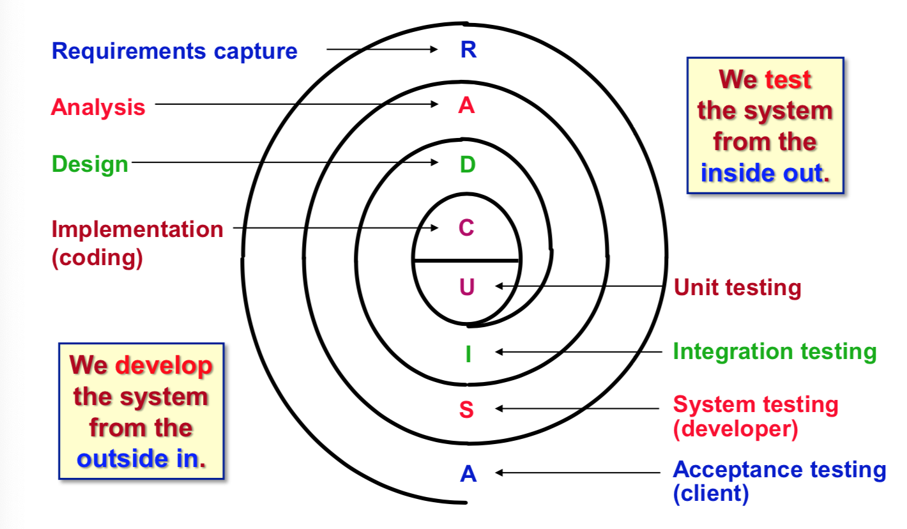

# COMP3111 Revision Notes

## Introduction

### Complexities of Software

#### Source of complexities

- Application domain
  - Complex problems
  - Developers without domain-specific background
- Communication between stakeholders
  - Stakeholders uses different vocabulary
  - Stakeholders have different background knowledge
  - Ambiguous use of language
- Management of large software development projects
  - Need to "Divide and Conquer" the project
  - Need to coordinate different parts and people
- Coding
  - Creating software is inheritly complicated

#### Consequences of complexities

- Quality issues
  - Unreliabe software
  - Unsafe application developed
  - Abandonment of project
  - Inflexible project management
- Development Problems
  - Over schedule and over budget
  - Does not meet user requirements
  - Slow progress
  - Difficult to measure progress

#### Dealing with complexities

- Many desirable software quality characteristics
  - Impossible to achieve all characteristics simultaneously
- Need to clearly understand design goals
- Need to prioritize design goals for a project
- **Aim: Reduce the complexity of designing the system**

#### Modular & Incremental Development

- Issue: Limit to Human Understanding
- Solution: Divide (into modules) and Conquer
- Module: Part of system that makes sense to consider separately
  - Problem: Inter-module interactions
  - Solution: See below
- Interfaces: Implementation of information hiding
  - Achieves abstraction
    - Module can be used without understanding the implementation
    - **Reduces complexity of understanding the system**
  - Achieves encapsulation
    - Module can be changed without affect the module behavior
    - **Reduces complexity of maintaining the system**
- Result of using Modular & Increment Development
  - More productivity in team development
  - Fewer bugs in system development
  - More maintainable software
  - More reusable software
  - More predictable software development

#### Training Software Engineers

- Definition: **"programming-in-the-small" = coding**
- Definition: **"programming-in-the-large" = software engineering**
- Abilities of a software engineer:
  - *Talk to users* in terms of the application
  - *Translate vague requirements* into specifications
  - *Build models of a system* at different levels of abstraction
  - *Use and apply* several software development processes
  - *Choose among design alternatives* (e.g. make design tradeoffs)
  - *Work in well-defined roles* as a part of a team
- **Reduces the complexity of building the system**

## Modeling Software Systems using UML

### Table of Contents

- UML and Object-Oriented Modeling
  - [Overview of UML](#what-is-uml-)
  - [Object-Oriented Modeling](#why-object-oriented-modeling-)
- [Class](#class)
  - [Attribute](#class-attribute)
  - [Operation](#class-operation)
- [Association](#association)
  - [Multiplicity](#association--multiplicity)
  - [Aggregation and Composition](#aggregation-composition-association)
- [Association Class](#association-class)
- [Generalization](#generalization)
  - [Inheritance](#generalization--winter)
  - [Coverage](#generalization--coverage)
- [Constraints](#constraints)

### What is UML?

- General-purpose visual modeling language for systems
- Incorporates current best practices in OO modeling techniques
- Software development methodology/process neutral
- Industry-standard OO modeling language for modeling systems

#### Why Build Models?

- Models abstract reality
  - Shows essential details and filters everything else
- Allows us to focus on programming-in-the-large
- Allows to better deal with *complexity* of software development
- Results in better understanding of requirements, cleaner designs, and more maintainable systems

### Why Object-Oriented Modeling?

- Allows direct representation of "things" in application domain
  - Reduces "semantic gap" between application domain and model
  - Better represents reality as perceived by people
- **Applicaiton Domain is modeled as a collection of objects.**

#### OO Modeling & Levels of Abstraction

- Requirements Level: Constructed by Requirements Model
  - Do not consider implementation
  - **Focus: Identifying objects/concepts in the application domain**
- Analysis & Design Level: Constructed by Solution Model
  - Consider interfaces of objects
  - **Focus: How objects interact in the solution**
- Implementation Level: Implements Solution Model
  - Consider all details of objects
  - **Focus: How to code objects**

### Class

```
---------------------
|      Account      |  <- Class Name
---------------------
| account#: Int     |  <- Attribute Compartment
| amount: Money     |
---------------------
| balance(): Money  |  <- Operation Compartment
| deposit(amount)   |
| withdraw(amount)  |
| payInterest()     |
---------------------
```

- Describes a **collection of objects** with common:
  - Sematics
  - Attributes
  - Operations
  - Relationships
- Factory for creating objects
- Should capture only one abstraction
- Named using vocabulary of the application domain
  - Meaningful and Traceable from the application domain to model

#### Class Attribute

- Describes the **data values** held by obejcts in a class.
- Syntax: `[ visibility ] < property-name > [ : property-type ] [ [multiplicity] ] [ = default-value ] [ property-modifier ]`
  - `visibility`: Who can access the attribute's values
    - `+`: `public`
    - `-`: `private`
    - `#`: `protected`
    - `~`: `package`
  - `property-name`: Unique within a class
  - `property-type`: Domain of values (e.g. string, integer, money etc.)
  - `multiplicity`: Number of simutaneous values
  - `default-value`: Attribute's initial value
  - `property-modifiers`: Unspecified or `readOnly`

#### Class Operation

- Describes a **function** or **transformation** that may be **applied to or by objects** in a class.
- Syntax: `[ visibility ] < signature >`
  - `visibility`: Who can access the attribute's values
    - `+`: `public`
    - `-`: `private`
    - `#`: `protected`
    - `~`: `package`
  - `signature`: `< operation-name > < ( parameter-list ) > < : return-spec >`
- Implementation of operation = Method
  - Operation can ahve several methods that implement it (*polymorphic operation*)

### Association


- Describes a **collection of links** with **common semantics**
  - Association is a classifier
  - Link is an instance
- Inherently *bi-directional*
- Can show navigability using arrowhead (`->`)
  - Implies source object has reference to target object

#### Association and Classes

- Two different classes be related by several associations


- Same class can be related by several associations


#### Association: Degree

- Unary: Relates one class to itself
  - `Person Manages Person`
- Binary: Relates two classes
  - `Customer Holds Account`

#### Association: Multiplicity

- Specifies a **restriction** on the **number of objects in a class** that may be **related to** an **object in another
class**.
- Example: `Bank[1..1] IsWith Account[0..*]`
  - A bank may have `0..*` accounts
  - An account must be with `1..1` bank
- Cardinality (`a..b`)
  - `a`: Minimum Cardinality
    - Minimum number of links
    - `a = 0`: Optional Participation
    - `a > 0`: Mandatory Participation
  - `b`: Maximum Cardinality
    - Maximum number of links
  - Special Cardinalities
    - `1` implies `1..1`
    - `*` implies `0..*`

#### Association: Role

- One end of an association
- Necessary to use role names when association *relates object from the same class*
  - Disambiguates relationships


#### Aggregation/Composition Association

- Describes assocations between classes which are "part-of" one-another
- Aggregation: Component may exist independently of the aggregate object


- Composition: Component may **not** exist independently of the aggregate object


- When to use Aggregation/Composition?
  - Aggregation *iff* class is **intrinsically** "part of" another class
  - Composition *iff* class operations can be applied to another class
  - If in doubt, just use *association*

### Association Class


- Usually used for many-to-many associations

### Generalization

- **Relationship** between **classes** of the **same kind**
- Classified by similarities of:
  - Attributes
  - Operations
  - Associations
- Goal: **Simplicity** of representation and **clarity** of modeling


#### Generalization: Inheritance

- **Taking up of properties** by a subclass from its superclass
- Associate common "things" to superclass, inherit them to subclass(es)
- Benefits:
  - Reduces redundency
  - Promotes reusability
  - Simplifies modification
- Subclass may:
  - Add new properties
  - Override superclass methods

#### Generalization: Abstract Class

- Class that has **no direct instances**
- Container for definitions


#### Generalization: Coverage

- Disjointness Coverage
  - `{overlapping}`: A superclass object can be a member of more than one subclass


  - `{disjoint}`: A superclass object is a member of at most one subclass


- Completeness Coverage
  - `{complete}`: All superclass objects must be instances of some subclass


  - `{incomplete}`: Some superclass object is not a member of any subclass


Example of all coverage types:


### Constraints

- **Assertion about properties** of model elements that **must be satisfied** by the system
- Should be enforced by the system implementation


- Types of Constraints
  - `{ordering}`
  - `{subset}`: Describes generalization of associations
  - `{xor}`: Only one of the associations can be active at once


## Software Engineering

- Overview
    - [The Four P's in Software Development](#the-four-p-s-in-software-development)
- Software Development Process
    - Monolithic
        - [Waterfall](#waterfall-process)
    - Iterative and Incremental
        - [Code-and-Fix](#code-and-fix-process)
        - [Prototyping](#prototyping-process)
        - [Spiral](#spiral-process)
        - [Phased-release](#phased-release-process)
        - [Agile](#agile-process)

- Software Development Life-Cycle Stages
  - Definition
  - Design
  - Development
  - Operation

### Four P's in Software Development

#### Project

- Compose a project plan, which includes:
  - Scope, objectives, constraints
    - Define the problem and set design goals
    - Analyze the requirements
    - Prepare a top-level system diagram
    - Estimate the time and effort
  - Risks
    - Murphy's Law
    - Identify likelihood and impact of risk + Confidence of risk assessment
    - Use 80:20 rule for estimation
  - Organization
    - Specify roles and responsibilities
    - Assign clear responsibilities with PICs for each team
  - Tasks and activities
    - **Task: Well-defined work assignment for a role**
    - **Activity: Group of related tasks**
    - Plan-Driven vs Agile-Driven development
  - Schedule
    - Specifies task ordering, time ordering, resource assignment, milestones, deliverables
    - **Master Schedule: Project Management**
    - **Macro Schedule: Day-to-Day Project Management**
    - **Micro Schedule: Team Management**
  - Estimations

#### Process

- Prescribes all major activities
- Has a set of guiding principles
- Uses resources to produce intermediate and final products
- May be composed of subprocesses
- Has an entry and exit criteria
- Organized in a sequence
- Constraints or controls may apply

#### (The other two P's)

- People
- Product

### Waterfall Process


| Pros | Cons |
| ---- | ---- |
| Imposes needed discipline | Assumes linear, sequential development is possible |
| Keeps development predictable and easy to monitor | Phases can be frozen until results are rigid |
| Enforces documentation standards and approval of documents | Different languages often used in each phase |
| Fits well with other engineering process models | Makes little opportunity for user feedback |

### Code-and-Fix Process


- Many changes
  - Leads to messy code structure
- Unsuitable for large systems
  - Turnover of personnel
  - Difficult to understand/fix code
  - Mismatching requirements

### Prototyping Process


- Code-and-Fix + Client Evaluation + Self-discipline
- Useful when requirements are vague or unknown

| Pros | Cons |
| ---- | ---- |
| Allows exploration of requirements | Not a complete software development process |
| Allows user feedback and approval | Process is not visible |
| Allows different solutions to be explored | Documentation is often sparse or absent |
| <p> | Final product is not a complete system |

### Spiral Process


| Pros | Cons |
| ---- | ---- |
| Risk evaluation can elp reduce development problems | Relies on expertise in risk assessment |
| Planning/Evaluation phases help meet client expectations | Needs more elaboration of phases |
| Iterative and incremental workflow facilities project management | More appropriate for internal development |

### Phased-Release Process


- Plan for changes ahead-of-time
  - Incremental Development: Parital system with full functionality
  - Iterative Development: Full system with partial functionality

| Pros | Cons |
| ---- | ---- |
| Reduces risk of project failure | Components need to be small |
| Promotes system modularity | Hard to identify common facilities required by all modules |
| Allows frequent releases | |
| Allows appropriate expertise to be applied |
| Allows early training and feedback | |

### Agile Process

- Any increment approaches where emphasis is placed on:

| More Important | Less Important |
| -------------- | -------------- |
| Individuals and Interactions | Processes and Tools |
| Working Software | Comprehensive Documentation |
| Client involvement/collaboration | Contract negotiation |
| Responsiveness to Change | Following a plan |

- Methods
  - Extreme Programming
  - Scrum

| Pros | Cons |
| ---- | ---- |
| Development is adaptable to changing requrements | Active user involvement and close collaboration required |
| Immediate feedback is provided | Lack of documentation |
| Faster speed-to-market | Potential scope-creep (adding of requirements) |
| Fewer defects in final product | Daily meetings can take a toll |

#### Extreme Programming

- Iterative programming, where each iteration:
  - Client selects features to be included
  - Developer breaks each iteration into tasks
  - For each task:
    - Designs task cases
    - Implements task using pair programming
    - Integrates the task into the product

#### Scrum

- No specific engineering practices: Team decide how to achieve tasks
- Requirements captured as items in a "product backlog"
- Developed in (iterative) "sprints"
  - Requirements not allowed to change during a sprint

## System Requirements Capture

- [Overview](#requirements-capture-overview)
  - [Importance of Requirements Capture](#importance-of-requirements-capture)
  - [Why Requirements Capture is Difficult](#difficulties-of-requirements-capture)
- [System Requirements Capture Activities](#system-requirements-capture-activities)
  - [Capture Data Requirements: Domain Modeling](#capture-data-requirements--domain-modeling)
  - [Capture Functional Requirements: Use-Case Modeling](#capture-functional-requirements--use-case-modeling)
  - [Capturing Nonfunctional Requirements](#nonfunctional-requirements)
  - [Validate System Requirements](#validate-system-requirements)

### Requirements Capture Overview

#### What is a Requirement?

- A **feature** that the system must have or a **constraint** that it must satisfy to be accepted by the client.
- Statement of _what_ the system will do **without** referring to _how_ it will do it
- Can range from *high-level abstract statement* of a service or s system constraint to a *detailed mathematical specification*

#### Types of Requirements

- User requirements
    - Diagrams + Natural Language
    - Written mainly for clients
- System requirements
    - *Structured document* setting out detailed description of the system
    - Defines what should be implemented
    - Written for clients and developers

#### Purpose of Requirements Capture

- **Specifies the behavior** of the final software system
- Involves:
    - Learning about the problem
    - Specifying the *required features and constraints*

#### Importance of Requirements Capture

- Reduces errors
- Reduces cost of software development

#### Difficulties of Requirements Capture

- Requires collaboration of stakeholders with different backgrounds
- Software engineer needs to bridge the knowledge gap:
    - Learn about the application domain
    - Transforming ideas to specifications
    - Choosing appropriate representations

### System Requirements Capture Activities

- Understand the *application domain* and *identify user needs*
    - Collect data on system requirements and constraints
    - Define development effort scope and system design goals
- Determine the **risks** of developing the system
    - Economic
    - Operational
    - Legal
    - Technical
    - Organizational
- Capture the system requirements
    - Data Requirements -> Domain Model
    - Functional Requirements -> User-Case Model
    - Non-Functional Requirements -> Supplementary text
- Validate the system requirements
    - Verify *correctness* and *completeness* of system requirements

#### System Requirements Specification (SRS)

- SRS documents the system requirements
    - Official statement of what is required of the system
    - Include user requirements and system requirements
- **NOT** a design document
    - States *what* the system should do, not *how* it should do it

#### Ways of Writing a SRS

- Natural Language
    - Sentences supplemented by diagrams and tables
- Structured Natural Language
    - Uses a *restricted language* that follows *fixed standards/template*
- Graphical Notations
    - Uses *graphical models* plus text annotations
- Design Description Languages
    - Uses a language like *programming languages*
- Mathematical Specifications
    - Uses notications based on mathetmatical concepts

#### Capturing Data Requirements: Domain Modeling

- Captures the most important *classes* and their *associations*
- Classes and associations are found from user requirements
- Classes can be:
    - Business objects
    - Read-world objects and concepts
    - Events

##### Domain Modeling: Identifying Classes and Associations

- Naturally occurring things or concepts in user requirements:
    - *Classes* appear as **nouns**
    - *Associations* appear as **verbs**
    - Define all terms in *singular, active voice*
- Identify only *relevant* classes/associations
    - Relevant = Essential, persistent
    - Leads to stable system
- Often has more than one decomposition

##### Domain Modeling: Identifying Attributes

- Usually correspond to *nouns* followed by *possessive phrases*
    - **password** of student
- Adjectives represents enumerated values
- Identify attributes that **directly** relate to application domain

##### Domain Modeling: Evaluating Classes

- Classes should:
    - Represent *relevant and persistent* data
    - Be specific and well-defined
- Classes should not:
    - Describe operations/actions
    - Describe implementation constructs

##### Domain Modeling: Evaluating Associations

- Associations should:
    - Describe a structual property
    - Be composed of as simple associations (ternary -> binary)
- Associations should not:
    - Describe trasient events
    - Contain derived associations
    - Describe implementation constructs

##### Domain Modeling: Evaluating Attributes

- Attributes should:
    - Be closely related to the class
    - Be dependent on the class
- Attributes should not:
    - Include object identifiers

##### Domain Modeling: Detail

- Class
    - Specifies attributes
    - Implies `get()` and `set()` operations
- Attribute
    - Specifies name, type, multiplicity
- Association
    - Specifies name, role names, multiplicity, association classes

#### Capture Functional Requirements: Use-Case Modeling

- Captures system behavior *from user's point of view*
- Developed incrementally with domain model
- Use cases describe all required functionality

##### Use-Case Modeling: Actors

- Represents something *outside* the system that *directly interacts* with it
    - Can be a person or another system
    - Provides input or receives output from the system
- Usually the source for discovering use cases
- Stereotype of a UML class
    - Actor is a classifier
    - User or system is an instance

##### Use-Case Modeling: Identifying Actors

- Possible to have a *domain model class* and an *actor* representing the **same thing**
- I/O devices are **NEVER** actors

##### Use-Case Modeling: Use Case

- A *specific way of using the system* by performing some part of its functionality
- Describes interaction between actor and system
    - Considered from the actor's viewpoint
- Complete sequence of events/actions
- **Always** initiated by an actor
- Initially, only consider normal sequence

##### Use-Case Modeling: Scenario

- Concrete, focused, informal description of a *single use* of the system from the viewpoint of a *single actor*
    - Attempt to carry out a use case
- Approaches to constructing use-case models:
    - Top-Down: `Use Cases -- Refinement --> Scenarios`
    - Bottom-Up: `Scenarios -- Abstraction --> Use Cases`
- Stereotype of a UML class
    - Use case is classifier
    - Scenario is instnace

##### Use-Case Modeling: Identifying Use Cases and Scenarios

- State a use case name...
    - From perspective of actor
    - As present-tense, verb-phrase
    - In active voice
- Provide...
    - Description of purpose
    - Outline of functionality
- Describe...
    - Using application domain terms

##### Use-Case Modeling: What is a Good Use Case?

- Typically represents major piece of functionality from beginning to end
- Must deliver something of value
- Better to have longer and more extensive use cases

##### Use-Case Detailed Specification

- Use case name
- Brief description
- Participating actors
- Preconditions
    - State of system/actors before use case can be performed
- Flow of events
    - Concise sequence of actions needed to accomplish a use case
    - General format: `The <something> <actions>.`
    - Language Constructs:
        - `if <boolean-expression>`
        - `for <iteration-expression>`
        - `while <boolean-expression>`
    - Extension Points: Named place to define additional behavior
        - Primarily used to define alternative flows
- Postconditions
    - State of system at the end of use case
- Alternative flows
    - Optional actions (*addition to* normal flow)
    - Variant actions (*replacing* normal flow)
    - Exceptional actions (*handling abnormal situations* in normal flow)
    - Should be numbered, and uniquely named
    - General declarations:
        - `At {extension point} <if/while> <condition/event>...`
        - `At any point between {extension point} and {extension point}...`
        - `At any time in the flow of events...`
    - Exit point declarations
        - Optional: Flow resumes at original extension point
        - Variant: Flow resumes at another extension point
        - Exceptional: Flow resumes, or use case ends
- Subflow
    - Segment of behavior with clear purpose and is "atomic"
    - Structures use-case description to improve readability
    - Should be named `S1, S2, ..., Sn`
    - Usage: `Perform subflow <subflow>`
- Special nonfunctional requirements

##### Use-Case Detail: How Much Detail?

- Until all ambiguities are resolved
- As much as it takes to satisfy all stakeholders

##### Use-Case Interaction & Decomposition

- Use cases only interact via the system
- Use cases should be independent of each other

#### Nonfunctional Requirements

- Constraint on use cases or system
- Includes:
    - Design Quality
    - Documentation
    - Hardware
    - Implementation
    - Interface
    - Management
    - Performance
    - Physical Environment
    - Security

##### Specifying Nonfunctional Requirements

- Specified as supplementary requirements
- Administration Use Cases: Solely deal with non-functional requirements

#### System Requirements Validation

- Requirements should be validated continously
- Requirements should be:
    - Complete: Describe all aspects of the system
    - Consistent: No contradiction
    - Clear: Defines a system which can only be interpreted in one way
    - Correct: Accurate representation of all system aspects
    - Realistic: Able to implement within constraints
- Validated by acceptance tests

## Implementation

- [Overview](#implementation-overview)
  - [Implementation Activities](#implementation-activities)
- [Producing Solid Code](#producing-solid-code--because-liquid-code-is-not-good-)
  - [Defensive Programming](#defensive-programming)
  - [Code Review](#code-review)
  - [Refacoring](#refactoring)
- [Debugging](#debugging)
- [Configuration Management](#configuration-managment)

### Implementation Overview

- Transform a design into *executable code*
- Implements the system in terms of:
    - Module: Part of system which packages implementations and provides interfaces
    - Subsystem: Organizes modules into manageable pieces

#### Implementation Activities

- Generate source code
    - Choose and code algorithms
- Assign classes to modules
    - Dependent on langauges
- Integrate modules and subsystems
    - Compile + Link into executables
    - Need VCS
    - Need integration
- Distribute executable modules

### Producing Solid Code *(because liquid code is not good)*

#### Defensive Programming

- First Rule: ~~You do not talk about defensive programming~~
- First Rule: Protect yourself at all times
    - Check values of all data from external sources
    - Check values of all input parameters
    - Decide how to handle bad inputs

##### Defensive Programming: Barricade Your Program

- Convert all possible inputs into trusted data via validation classes

##### Assertions

- Use them
    - Preconditions: Assertion prior to statement
    - Postconditions: Assertion after statement
- Deduce them by:
    - Forward Reasoning: From preconditions, deduce postconditions
        - More intuitive, but may rapidly increase complexity
    - Backward Reasoning: From postconditions, deduce preconditions
        - More helpful
- Useful checks
    - `lowerBound <= value < upperBound`
    - `File/Stream.isOpen()`
    - Preservation of `const`/`final`-ness
    - `ptr != nullptr`
    - `array.size >= size`
    - `table.all { value.isReal() }`
    - `container.isEmpty()` or `container.isFull()`
- Guidelines
    - Use assertions to...
        - Document and verify preconditions/postconditions
        - Verify certain conditions never occur

#### Code Review

- Offline version of pair-programming
- Review code written by other devs
- Collbrate and not blame

##### Motivation

- Catch bugs and design flaws early
- Let more than one person see the code
- Forces code authors to review their decisions
- Allows junior devs to get early hands-on experience
- Hold everyone accountable
- Assessment of performance

##### Process

- What is reviewed?
    - Specifications
    - Modules
    - Completed code
- Who participates?
    - At least one other dev
- Where?
    - Formal, in person
    - Informal, email/chat

#### Refactoring

- Improving internal structure without altering behavior
- Keep code to be:
    - Able to execute its functionality
    - Able for change
    - Able to communicate its intentions

##### Low-Level Refactoring

- Names
    - Renaming operations/variables
    - Naming/Extracting "magic" constants
- Procedures
    - Extracting code into a method
    - Extracting common functionality into a module/operation
    - Inlining procedures
    - Changing operation signatures
- Reodering
    - Splitting operations into several
    - Putting statements together

##### High-Level Refactoring

- Opt for safer language idioms
- Clarifying an unclear statement
- Optimizations
- Refactor design patterns
- *Is harder, but more important*

##### Refactoring Plan

1. Assume you have time
2. Write unit tests to ensure behavior is kept
3. Refactor the code
4. Add new features

##### "I have no time!"

- Refactoring is expensive time-wise and cost-wise
- But has long-lasting benefits
- Do it continually

### Debugging

#### Defense 1: Make Error Impossible by Design

- In the Language
    - Java makes memory bugs impossible
- In protocols/libraries/modules
    - TCP/IP guarantees data is not reordered
    - BigInteger guarantees no overflow
- Self-imposed conventions
    - Hierarchical locking guarantees no deadlock
    - Banning recusion guarantees lack of infinite recusion and stack overflow
    - Immutable data guarantees behavioral equality

#### Defense 2: Do not Introduce Defects

- Gets things right the first time
    - Think before you code
    - More easy-to-find bugs = More hard-to-find bugs
- KISS (Keep It Simple, Stupid)
    - Modularity
        - Divide program into smaller chunks
        - Use ADT with well-defined interfaces
        - Defensive Programming
    - Specification
        - Write specifications for all modules

#### Defense 3: Fail-Fast

- Localize bugs to a small part of program
- Take advantage of modularity
    - Start with everything, and strip until bug appears
    - Start with nothing, and add until bug appears
- Take advantage of modular reasoning
    - Trace program and view intermediates
- Binary Search lines of code
- Use assertions

#### Can't find the bug?

- Look for stupid mistakes, e.g.
    - Reversed order of arguments: `Collections.copy(src, dest)`
    - Misspelling of identifiers
    - `a == b` vs `a.equals(b)`
    - Failed to reinitialize variable
    - Deep vs shallow copy
- Ensure you have the right source code

#### Inserting Checks

- Insert lots of checks
- Stop the program as close to the bug as possible
- Assertions in production?
    - Yes: Don't take risks
    - No: Application can force its way

#### Regression Testing

- Whenever a bug is discovered:
    - Add a test
    - Re-run all tests

#### The Last Resort

- Bugs happen ¯\\\_(ツ)\_/¯
    - Found in integration or reported by user
- Steps to correct
    1. Clarify symptom
    2. Find and understand cause
    3. Fix
    4. Test all

#### Still no clue?

- Reconsider assumptions
    - OS Change? Hard Drive has space?
    - Debug the code, not the comments
- (Re-)Documenting the system
- Get help
- Walk away

### Configuration Management

Manages, controls and monitors changes to lifecycle artifacts

- Change management
    - Tracks and evaluates proposed changes
- Version management
    - Tracks and manages versions of systems
- System building
    - Creates executable system from components, data and libraries
- Release management
    - Prepares and tracks system versions

#### Change Managment

Ensures system evolution is managed, giving priority to *most urgent* and *cost-effective* changes.

- Support: Using Software Library
    - Provides facilities to store, label and identify version
    - Tracks status of configuration items
- Change Control: Using Baselines
    - Time/phase of development when all changes must be formalized/controlled
    - Uses formal review procedures to evaluate whether to integrate into software library
- Auditing: Ensure changes are properly implemented
    - Done by QA team
- Status Reporting: Keeps all parties informed and up-to-date

#### Version Management

Ensures integrity and consistency of configuration items.

- Codeline: Sequence of versions, where later versions are derived from earlier versions
- Version: Where item `k` is obtained by modifying item `i`, superseding it
- Branch: Concurrnt development path requiring independent configuration management
- Variant: Different configrations which shoudl coexist

## Testing

### Table of Contents

- [Purpose](#purpose)
- [Reality](#reality)
- [Plan Tests](#plan-tests)
  * [Input Space Partitioning](#input-space-partitioning)
    + [Naive: Execution Equivalence](#naive--execution-equivalence)
    + [Better: Revealing Subdomains](#better--revealing-subdomains)
- [Design Tests](#design-tests)
  * [Steps](#steps)
  * [Types of Test Cases](#types-of-test-cases)
    + [White Box: "Testing-in-the-small"](#white-box---testing-in-the-small-)
    + [Black Box: "Testing-in-the-large"](#black-box---testing-in-the-large-)
    + [Regression: "Re-testing"](#regression---re-testing-)
- [Implement Tests](#implement-tests)
- [Perform Tests](#perform-tests)
  * [Testing Strategy](#testing-strategy)
    + [Unit Testing](#unit-testing)
    + [Integration Testing](#integration-testing)
    + [System Testing](#system-testing)
    + [Acceptance Testing](#acceptance-testing)
- [Evaluate Tests](#evaluate-tests)

### Purpose

- Validation: built the right product - Acceptance tests
- Verification: built the product right - unit, integration, system tests

### Reality

- Cannot prove absense of errors
- Cannot completely test a nontrivial system
- is destructive: try to break software and find bugs

### Plan Tests

- Exhaustive runs are not feasible
- Goal: design such that tests have highest likelihood to find defects with minimum time and effort

1. Testing strategy: what tests, how to test, how much coverage
2. Testing schedule
3. Reource estimate

- Choose test suite (input set)
- Test-stopping criteria

#### Input Space Partitioning

- Equivalent input sets give same program behaviour

##### Naive: Execution Equivalence

- In `abs(x)`, all `x<0` are execution equivalent because the program takes the same sequence of steps for any `x<0`
- Does not reveal error if the assumptions are buggy, e.g. `{-3,3}` on `... if (x < -2) return -x`

##### Better: Revealing Subdomains

- Define "same behaviour on two inputs" if their truth values agree (both correct or both wrong)
- A Subdomain is *revealing for an error E* if
    - All elements of this subdomain have same behaviour
    - If error E occurs, the test with this subdomain reveals it
    - e.g. `{-3,-2, -1}` which all returns `-x`, reveals bug of `abs (x) ... if (x < -2) return -x`
- Heuristics
    - Partition based on program-dependent information (actual code) and program-independent information (requirements, algorithms, data structures)
    - Good heuristic has few domains and high probability to reveal error E
    - Combine multiple heuristics

### Design Tests

- A Test case is *one way* of testing the system

#### Steps

1. Choose input data, software configuration
2. Define expected output
3. Run against input and record
4. Compare against expected

#### Types of Test Cases

##### White Box: "Testing-in-the-small"

- Use source code (knowledge of internal workings)
- Verify component logic with data and control structures
- Statement Testing: Executing every statement is insufficient to discover errors because statements could skip buggy code/inputs (e.g. `i=0; x = y/i` but `i++` is optional) and could involve global states

1. Basis Path Testing: Execute independent paths at least once
    1. Draw graph of program statements, then flow graph of nodes (group statements with no branching as a node)
    2. Calculate **Cyclomatic Complexity** `V(G)` (by counting no. of regions including outermost)
    3. Choose a *basis set of n linearly independent paths* with `n <= V(G)`
        - Independent Path: Path that traverses at least one new statement. Identify with statement number
        - Basis Set: Collect enough independet paths to cover the code. Non-unique set
    4. Write test cases that force execution of each path in the basis set
        - Derive test cases from the basis set guarantees that every statement is executed once; is the minimum number of use cases required
        - So it does not test all possible combinations of paths
        - Apply to all components if possible, critical components always
        - For compound logical tests, perform `no. of boolean operators + 1` tests (e.g. 1 `&&` has 2 cases)


2. Condition Testing: Execute true and false value of every simple logical conditon in the component
    - Types
        1. Simple condition: `rel-op = {<, <=, ==, !=, >=, >}` and their `NOT`
        2. Compound condition: `AND`, `OR`
        3. Relational expression: simple condition on arithmetic expressions (E1 = 1 + 1 == 3 = E2)
        4. Boolean expression: `NOT` of expressions

    1. Branch Testing: (`C = A AND B` then test for all cases `{C, A, B}` equals T/F)
        - Handled in Basis Path Testing
    2. Domain Testing: `E1 rel-op E2` where `E1`, `E2` are numbers
        - Test `E1 > E2`, `E1 == E2`, `E1 < E2`
        - If difference `|E1 - E2|` is small, more likely to detect errors (boundary cases)


3. Loop Testing: Execute loops at boundaries and normal values
    1. Simple Loops
        1. 0, 1, 2 passes
        2. `m < n` passes
        3. `{n-1, n, n+1}` passes
    2. Nested Loops (tests grow geometrically with levels)
        1. Fixing Outer loops at inital minimum values
        2. Perform Simple Loop test in innermost loop
        3. Work outward on next (second, ...) innermost loop, until outermost loop is tested
    3. Concatenated Loops (same level)
        1. If loops are independent, do separate Simple Loop tests
        2. If not, fix first loop as the outer loop and perform Nested Loop tests
    4. Unstructured Loops (`goto`), Refactor

    Loop tests tend to reveal most errors with minimal effort and test overlap

4. Data Flow Testing: Check variables hold values as expected
    - A Variable (X) Definition (S), Uses (S') chain has the same `X` value from statement number `S` to `S'`
    - DU Chains `[(X, S1, S1'), (X, S2, S2'), ...]` partition the program into parts where `X` is not changed (redefined)
    - Strategy: For each variable `X`, perform test along the path `S -> S'` so that every DU chain is covered once. This can be combined with Basis Path testing

##### Black Box: "Testing-in-the-large"

- Require component usage only (knowledge of supposed functionality, access to executable code)
- Verify component functionality with inputs and outputs
- Attempts to find
    - functions incorrect or missing
    - interface incompatibility
    - data structure or database access errors
    - performance errors
    - initialisation and termination errors
- Need to report the presense/absence of a *class* of errors, so we test a range of input/output values, not a singular value
    - Equivalence Partitioning: creates subdomains (again)
        - Common partition heuristic: `{valid, invalid}` (normal values are in `valid`)

            | Input | Subdomains | Illustration |
            | -------- | -------- | -------- |
            | Range     |  1 valid, 2 invalid smaller and larger    | `a[..b..]c`     |
            | Specific value     |  1 exact, 2 invalid smaller and larger    | `a[b]c`     |
            | Set of values     |  1 member of set, 1 non-member of set    | `a in S`, `b not in S`     |
            | Boolean     |  1 boolean, 1 non-boolean    | `Boolean a `, `NonBoolean b`     |

1. Boundary Testing
    - More erros occur at the boundaries of subdomains than in the center, due to off-by-one / empty container / NPE / overflow / cannot handle object aliasing
    - Select small boundary subdomains of main subdomains, they have high probability of revealing common errors
    - Test Value Selection Heuristics

        | Input | Test Values / Subdomains | Illustration |
        | -------- | -------- | -------- |
        | Range     |  just above and below both bounds    | `a[bc......de]f`     |
        | Discrete values     |  just above and below both min and max value    | `a[bc _ _ _ de]f`     |
        | Set of values     |  all members in the set (if possible), 1 non-member of set    | `all a in S`, `b not in S`     |
        | Boolean     |  1 true, 1 false, 1 non-boolean    | `Boolean a `, `NonBoolean b`     |
        | Any (e.g. Table)     |  min and max values (e.g. sizes: 1 row, MAX rows)    |      |
        | Data Structure     |  just above and below both min and max value if defined (e.g. array index -1, 0, 1, n-1, n, n+1)    |      |

    - Test cases and values

        | Test Type | Test Case | Expected | Test Value |
        | --------- | --------- | -------- | ---------- |
        | **Boundary Values**     | Minimum Range     | Valid Student ID (Record existent)    | 1000000         |
        | Boundary Values     | Minimum Range     | Valid Student ID (Record existent)    | 1000001         |
        | Boundary Values     | Minimum Range     | Invalid Student ID     | 999999         |
        | Boundary Values     | Maximum Range     | Valid Student ID (Record existent)    | 9999999         |
        | Boundary Values     | Maximum Range     | Valid Student ID (Record existent)    | 9999998         |
        | Boundary Values     | Maximum Range     | Invalid Student ID     | 10000000         |
        | **Typical Values**     | Mid-Range     | Valid Student ID (Record existent)    | 5000000         |
        | Typical Values     | Mid-Range     | Valid Student ID (Record non-existent)    | 5000001         |
        | Typical Values     | Below lower Range     | Invalid Student ID     | 500000         |
        | Typical Values     | Above lower Range     | Invalid Student ID     | 50000000         |
        | **Other Values**     | Nonnumeric     | Invalid Student ID     | leet1337         |

        Format
        - Test Case #
        - Setup (Ensure record existent)
        - Test Value
        - Verification


2. Thread Testing
    - For events that trigger system actions
    - After unit testing and integration to subsystems
    - Strategy: Identify and execute (each if possible) most common executed threads (as use cases) as it is the *basic flow of events*
    - Types
        - Single thread
        - Multiple thread: branches out
        - Multi-input thread: branches in


3. State-based Testing
    - For programs with too many states, e.g. MS Paint
    - Use **State Machine Diagram** for a class
    - Derive a *representative set of stimuli (events)* for each *transition*
    - Strategy: Put class in desired initial state, then apply stimuli. Check attributes or links of class again expected end states


##### Regression: "Re-testing"

- Uses White and Black Box test cases selectively
- Verify no new defects on making new changes (Old code still works)

When a bug is found

1. Reproduce bug
2. Record input for the reproduction
3. Record the supposed correct output
4. Log everything into test suite
5. Fix bug and verify

- This populates (expands) the test suite with good tests
- Prevent from reintroducing the bug: once it happened once, could happen again

### Implement Tests

- Goal: Automate test procedures as much as possible
- Write *test components*: records actions, parametrises inputs
- Use spreadsheets/database application to store input and output of tests

### Perform Tests

#### Overview


#### Testing Strategy

- Specifies which testing technique(s) *(White Box, Black Box)* are appropriate at which point of time
- Integrates test cases into well-planned series of steps
    - Specifies steps to test a component
    - Specifies when those steps will be undertaken
    - Specifies how much resources (effort, time) will be required
- Test Planning is difficult due to debugging time uncertainty
    - A testing strategy needs to balance betwwen *flexibility and creativity* vs *planning and management*
- Testing occurs often when deadline pressure is most severe
    - Make progress measureable
    - Identify problems early on



##### Unit Testing

- Use White Box (*Main emphasis*) and Black Box
- Verify correct functions of component / subsystem
- Done by developers

Components developed for each unit test:

- Drivers: takes a test case *(interface, independent paths, boundary conditon, local data structure, error-handling paths)*, calls a component, outputs results
- Stubs: called by the component under test

In the object-oriented setting:

- What to test: All states of a class (the object). Use *State-based testing*
- Inheritance and Polymorphism: All subclass methods (overridden or not) must be tested due to dynamic binding and sustainability
- Encapsulation: Need method to report all internal states
    - e.g. `Stack::peek` for `new empty stack -> push -> pop -> peek` reports empty stack

##### Integration Testing

- Use White Box and Black Box
- Verify correct interactions between component / subsystem
- Done by developers / independent test group (integration/system tester)

- Interaction errors *(interface misuse, timing errors)* cannot be uncovered by unit testing
- Approach (avoid Big Bang):
    1. Incremental construction
    2. Incremental builds
    3. Regression

Strategies:

1. Top Down

    1. Test subsystem with placeholder stubs
    2. Replace stubs breadth/depth-first
    3. Regression-test subset of previous tests

    - Pros: Interface errors early detection. Can demonstrate complete system functionality earlier.
    - Cons: Low-level processes are postponed until late testing. Effort to write and test stubs.

2. Bottom Up

    1. Group subsystems into builds, integrate
    2. Replace drivers one at a time in depth-first manner

    - Pros: Interaction errors early detection. Easier test case design (eliminates need for stubs).
    - Cons: User interface testings are postponed.

3. Sandwich

    - Test top-level subsystems with stubs
    - Group lower-level subsystems into builds. Test them with drivers

    - Pros: Allows for parallel testing. Significantly shorten total testing time.
    - Cons: Require maintaining numerous drivers and stubs.

Critical subsystems:

- Characteristics
    - Has high risk
    - Addresses multiple requirements (implements multiple use cases)
    - Has high level of control
    - Are complex, error-prone, high cyclomatic complexity
    - requried specific performance
- Requires *Regression Testing*


##### System Testing

- Use Black Box
- Verify correct functions of the system as a whole (properly integrated)
- Done by independent test group (integration/system tester)

Types:
- Funcational Testing: verify all user functions working as specified in *system requirements specification*
- **Performance Testing**: verify having met design goals (nonfunctional requirements)
    - Stress: when confronted with many simultaneous requests (how much can it handle? Fails softly or collapses?)
    - Volume: can handle data (in large amounts), algorithm (of high complexity), disk (high fragmentation)
    - Security: access protection mechanism works (make penetration more costly than value of entry)
    - Timing: meets timing constraints (for real-time and embedded systems)
    - Recovery: can recover when forced to fail in various ways (like in database)


- **Pilot Testing**: a group of end users verifies common functionality
    - Alpha test: in controlled environment at developer's site, developers can observe users
    - Beta test: in real environment at client's site. Client reports bugs to developer from regular usage patterns


- **Acceptance Testing**: clilent/user verifies usability, validates functional *and* nonfunctional requirements against system requirements specification*
    - *Demonstrates/Show* to client that functions and constraints of the system are fully operational

    Parts
    - Functional validity
    - Interface validity: desired input-output functions. follows required design standard.
    - Information content: storing correct data in required constraints/formats
    - Performance

    Deriving
    1. Restate written requirements *concisely, precisely, testably* by grouping related requirements and removing untestable requirements
    2. Add additional requirements from user feedback by referencing
        - use cases: for functional and interface requirements
        - domain model: for information content requirements
        - nonfunctonal for requirements: performance requirements

    3. Construct an **evaluation scenario** to show having met the requirement for each requirement
        - Devise test case for each requirement (so that they are operational)

- Installation Testing: clilent/user verifies usability, validates unctional *and* nonfunctional requirements in actual usage


##### Acceptance Testing

- Use Black Box
- Validates software against requirements
- Done by client / user
- Refer to **System Testing > Acceptance Testing**

### Evaluate Tests

- *Test engineer* compares results against goals in test plan
- Prepares metrics to determine quality of software
- Stop testing by criteria, *decided during Test Planning*
    - Testing completeness (coverage of completed test cases and tested code)
    - Reliability (testing error rate)
        - Against expected failure rate (based on previous projects)
        - Plot expected vs actual (current) failure rate
- Possible outcomes
    - Perform additional tests (for more defects)
    - Relax test criteria
    - Deliver acceptance parts of system (revise and test unaccepted parts)
- Testing under pressure
    - Test Functionality (system capabilities) > Test components
    - Test old capabilities > Test new capabilities
    - Test typical cases > Test boundary cases

## System Analysis and Design

- System Analysis and Design Overview
  - [The Purpose and Importance of System Analysis and Design](#the-purpose-and-importance-of-system-analysis-and-design)
  - [Realizing Design Goals](#realizing-design-goals)
  - [Dealing with the Implementation Environment](#dealing-with-the-implementation-environment)
- System Analysis and Design Activities
  - [Architectural Analysis and Design](#architectural-analysis-and-design)
  - [Use-case Analysis](#use-case-analysis)
  - [Class Design](#class-design)
  - [Object Behavior Analysis: State Machine Diagrams](#object-behavior-analysis--state-machine-diagrams)
  - [Design Patterns](#design-patterns)
  - [Anti Patterns](#anti-patterns)

### System Analysis and Design Overview

#### The Purpose and Importance of System Analysis and Design

- System is gradually structured into basic parts with well-defined relationships
    1. Build the system skeleton
        - Produce a stable basis
        - Skeleton provided by software architecture
    2. Grow the system
        - Produce a finer system structure
        - Accomplished by analysis and design workflows
- Use-case model is not sufficiently formal
    - Requires complete specification to remove *ambiguities* and *redundancies*
    - Need precise requirements in developer's language
    - Need structure requirements for *understanding* and *maintenance*

#### Realizing Design Goals

- Need to decide how to realize design goals
- Need to prioritize design goals, develop trade-offs

#### Dealing with the Implementation Environment

- Encapsulate and isolate implementation environment
    - Use bridge classes

### System Analysis and Design Activities

#### Architectural Analysis and Design

- Focuses on
    - Understanding the organization of a system
    - Designing the overall structure of a system
- Identifies subsystems based on *main structural components* and *relationships between them*
    - Encapsulates its contents, providing services via interfaces
    - Provides information hiding
- Nonfunctional requirements dependent on system architecture

##### Layers and Paritions

- Subsystem Layers
    1. Closed layered: Each layer can only depend on the layer below it
    2. Open layered: Each layer can depend on any layers below it

##### Architecture Decisions

- Based on nonfunctional requirements
    - Performance: Use small number of subsystems to localize critical functions
    - Security: Use a layered architecture with critical assets in innermost layer
    - Safety
    - Availability: Include redundant subsystems to allow maintainence without stopping the system
    - Maintainabilty

##### Architectural Patterns

- Specifies how to *organize and connect* a set of software components
- Includes specification of
    - System decomposition
    - Global control flow
    - Error handling policies
    - Inter-module/component communication protocols
- Types of Patterns
    - Multi-Layer: Each layer only communicates with the layers below it
    - Repository: Centralize management of data
    - Client-Server: Separate and distribute system functionality
    - Broker: Distribute system aspects to different nodes transparently
    - Transaction Processing: Direct input to specialized subsystems
    - Pipe-and-Filter: Provides flexibility, modifiability and reusability of subsystems
    - MVC: Separate UI layer from other parts

#### Use-case Analysis

##### Analysis Classes

- Abstraction of classes in the final system implementation
- Representation is conceptual
    - Conceptual attribute types
    - Behavior defined by responsibilities
    - Conceptual relationships
- Can be:
    - Boundary: Models interaction between system and actors
        - Represents abstraction of UI or devices
        - Identified by primary UI window or communication interface
    - Entity: Models long-living, persistent information
        - Represents concepts e.g. individual, real-life object/event
        - Identified by domain model classes
    - Control: Models coordination, sequencing, transactions, control behavior
        - Represents control or business logic
        - Generally tied to each actor/use-case pair
- Best Practices
    - Actors can *only* interact with boundary objects
    - [Initially] Boundary objects can interact *only* with control object and actors
    - [Initially] Entity objects can interact *only* with control objects
    - Control objects can interact with any other type of object
- Use-Case Partitioning: Dividing all use cases into a collaboration of analysis classes

#### Class Design

- Class with sufficiently completed specifications such that it can be implemented
- Need to implement *problem domain classes* using *solution domain classes*
    - Boundary Class: Determined by UI technologies
    - Entity Class: Determined by data management technologies
    - Control Class: Determined by issues related to distribution, performance, transactions
- Activities
    - Select reusable components
        - Class libraries and design patterns
    - Complete the specification
        - Add attributes, associations, operations, types, visibilities, constraints
    - Restructure the design model
        - Add associations, apply inheritance
    - Optimize the design model
        - Revise access paths, collapse classes, cache/delay computations
- Cohesion and Coupling
    - Prefer **High Cohesion**: One class does a specific thing
    - Prefer **Loose Coupling**: One class has minimal dependencies with others
- SOLID Design Principle
    - Single Responsibility Principle
    - Open-Closed Principle
        - Open for extension, closed for modification
    - Liskov Substitution Principle
        - Where a superclass can be used, all its subclasses can be used as well
    - Interface Segregation Principle
        - Do not force clients to depend upon interfaces they don't use
    - Dependency Inversion Principle
        - High-level modules and Low-level modules should depend on abstractions
        - Details should depend on abstractions

#### Object Behavior Analysis: State Machine Diagrams

- Describes behavior inside an object
- Directed graph, where:
    - Vertices: States
    - Edges: Events causing state changes (Transition)
- States
    - Time during the object life time
    - Satisfies a condition, performs an action, waits for an event
    - Has duration
    - Characterized by:
        - Value of one or more attributes
        - Link to another object
- Transition
    - Change of state
    - Takes zero-time and cannot be interrupted
    - Can optionally include:
        - Event Trigger
        - Guard Condition
        - Effect List
- Event
    - Something that happens at an instantaneous time point
    - Can include:
        - Call Event: Receipt of a *synchronous call* from an object (callback?)
        - Change Event: Specified boolean condition becoming true
        - Time Event: When a time point is reached
        - Signal Event: Receipt of an *async communication* from an object (listener?)
- Event/Transition Mechanics
    - Events are processed one at a time
    - Only one transition within a state machine diagram may fire
    - Transition can be:
        - Automatic: When activity of state completes
        - Non-automatic: Caused by event
- Actions & Activities
    - Action: Instantaneous and cannot be interrupted
        - Processes transitions between states or into/out of a state
    - Activity: Takes time to complete and can be interrupted
        - Processing that occurs while in a state
    - Forms of State Behavior
        - `(no behavior)`: Wait until event occurs, exiting the state
        - `[event-trigger] [guard-condition] / [effect-list]`: Perform `effect-list` if `event-trigger` occurs and `guard-conditon` is true
        - `do / activity`: Perform `activity` while state is active
        - `entry / activity`: Perform `activity` when state is entered
        - `exit / activity`: Perform `activity` when state is exited
- Composite State Machine Diagram
    - Sequential: Object is in exactly *one state* in one of the *nested state machine diagrams*
        - Used to abstract/generalize states
    - Concurrent: Object is in exactly *one state* in *each of the regions* of the state machine diagrams
        - Used to show multi-threading behavior
    - Transitions
        - Transition to boundary: Transition into initial state
            - `entry / activity` is performed for all regions entered
        - Transition from boundary: Transition from composite state
            - `exit / activity` is performed for all regions exited
        - Transitions can cross directly from/to composite state region
        - Transitions may have *multiple source/target states*
- When to use State machine Diagram
    - When describing behavior of object across several use cases
    - Used for classes with *significant* dynamic behavior

#### Design Patterns

- Reusable solution to a commonly occurring problem
- Template for solving certain problems
- Common Design Principles
    - Separate mutable aspects from immutable aspects
    - Program to an interface, not an implementation
    - Favor composition (*has-a*) over inheritance (*is-a*)
- Common Design Patterns
    - Strategy Pattern
        - `Client` class contains a reference to the `Strategy` interface
        - Multiple subclasses implements `Strategy`, forming concrete implementations
    - Observer Pattern
        - Defines one-to-many dependency
        - When `subject` obejct changes state, all registered dependencies are notified
    - Mediator Pattern
        - All componenets interact with a mediator
        - Commonly used to coordinate GUI components
    - Proxy Pattern
        - Defers object creation and initialization until usage
    - Bridge Pattern
        - Separate abstraction and implementation using a bridge association
    - Singleton Pattern
        - Classes which can only have one instance
    - Factory Pattern
        - Object creation without specifying the exact class

#### Anti Patterns

- Spaghetti Code: Code with convoluted structure
    - Difficult to maintain or modify
- God Class: Class that has too many attributes/operations
    - Violates cohesion

## Software Quality Assurance

- Overview
  - [Purpose and Importance](#purpose-and-importance)
- [Achieving Software Quality](#achieving-software-quality)
  - [SQA Activities](#sqa-activities)
  - [Achieving Product Quality](#achieving-product-quality)
  - [Achieving Project Quality](#achieving-project-quality)
  - [Achieving Process Quality](#achieving-process-quality)
  - [Achieving People Quality](#achieving-process-quality)

### Purpose and Importance

- Consists of procedures/techniques/tools applied by professionals
- Ensures that prodcut meets/exceeds pre-specified standards during its development cycle

```
Quality Assurance      Defines organizational standards
  requires ↓
Quality Planning       Tailors standards to specific product
  requires ↓
Quality Control        Ensures standards are followed
```

- Allows defects to be identified and fixed early in the development process

### Achieving Software Quality


1. Product must have set of quality attributes to meet
2. Quality attributes should be measurable
    - Determines how well the product conforms to design goals
3. Keep track of the quality attributes
    - Allows assessment of achieving design goals over time
4. Use the information to improve the quality of future products
    - Allows feedback in development process

#### SQA Activities

##### Standards

- Norm/Requirement establishing uniform criteria, methods, processes, practices
    1. Product standards: Characteristics that all product artifacts should exhibit
    2. Process standards: How the software process should be conducted
- Importance
    1. Documents the best/appropriate practices
    2. Provide a framework to implement quality control
    3. Ensures the continuity of project work
- Standards Evaluation: Deciding the stanards to...
    - Ignore?
    - Used as is?
    - Modified?
    - Created?

##### Metrics

Type of measurements related to a software product, process, or artifact.

- Importance
    1. Used to control the development process
    2. Used to predict product quality
- Objective way to measure quality attributes

#### Achieving Product Quality

- Design Goals: External quality attributes we want to have
    - Predicted using internal quality attributes
- Metrics for System Design
    - Key Goal: Maintainability
    1. Strctural fan-in/fan-out
        - Fan-in: Number of calls to a component from others
            - High fan-in: High coupling
        - Fan-out: Number of components called by component
            - High fan-out: Caller has high complexity
    2. Informational fan-in/fan-out
        - Considers number of parameters and access to shared data
        - `complexity = component-length * (fan-in * fan-out)^2`
        - Predicts effort required for implementation
    3. IEEE Standard 982.1-1988
        - Considers properties of subsystems and database
            - Computes Design Structure Quality Index
        - Considers changes during the product lifetime and stability of product
            - Defines Software Maturity Index
- Metrics for Implementation
    1. Halstead's Software Science
    2. McCabe's Complexity Metric
    3. Lines of Code
    4. Length of identifiers
    5. Depth of conditional nesting
- Formal Approaches
    1. Proving programs/specifications are correct
    2. Statistical Quality Assurance
    3. Cleanroom Process

#### Achieving Project Quality

- Reviews: Primary method for achieving project quality
- Software Configuration Management: Manages, controls and monitors changes to life cycle artifacts

#### Achieving Process Quality

- Importance?
    - Software quality can be independent of the process used
    - People/Technology are *sometimes* more important than the process
    - Software development process is often not transferable
- ISO 9001/9000-3
    - ISO 9000: Specifies actions to be taken when a system has quality goals and constraints
    - ISO 9001 (clause 4.2): Organization must have documented quality system
    - ISO 9000-3: How a quality system should be integrated in a software development process
- SEI Process Capability Maturity Model
    - Intended to assess/improve software development processes
    1. Initial Process (ad hoc)
        - Nothing formal really
    2. Repeatable Process (intuitive)
        - Basic project controls
        - Intuitive methods used
    3. Defined Process (qualitative)
        - Well-defined development process
        - Training provided
    4. Managed Process (quantitative)
        - Measured process
        - Process database established
    5. Optimizing Process
        - Improvement feedback
        - Defect-cause analysis and prevention

#### Achieving People Quality

- People Capability Maturity Model (PCMM)
    - Intended to assess and improve knowledge and skill of people
    1. Initial
        - Nothing formal really
    2. Repeatable
        - Focus on developing basic work practices
        - Training to fill "skill gaps"
        - Performance evaluated
    3. Defined
        - Focus on tailoring work practices
        - Strategic plan to local/develop required talent
        - Skill-based compensation
    4. Managed
        - Focused on increasing competence in critical skills
        - Mentoring, team-building
        - Evaluation of work practice effectiveness
    5. Optimizing
        - Focus on improving team/individual skills

## Managing Software Development

- The Software Development Plan
  - [Deliverables](#deliverables)
  - [Development Environment](#development-environment)
  - [Work Breakdown Structure](#work-breakdown-structure)
  - [Staffing-and-Organization](#staffing-and-organization)
  - [Schedules](#schedules)
  - [Estimates](#estimates)
  - [Metrics Plan](#metrics-plan)
  - [Risk Planning](#risk-planning)
  - [Time-phased Budge](#time-phased-budget)
- [Project Tracking and Control](#project-tracking-and-control)

### The Software Development Plan

Documents the scope of the development effort, and how the project will be managed.

- Constrainted optimization problem with incomplete data
- Input for SDP:
    - Development Manager
        - Organizes project, tasks, budget
    - Experienced System Architect
        - Design top-level system structure
        - Estimate project's technical size
    - Expert User/Domain Expert
        - Provide understanding of requirements

#### Deliverables

SDP specifies when something should be delivered to who.

- Client Products: Given to client
- Process artifacts: Outcomes of development process
- Internal deliverables: Continuing value to the development organization
- Services: Additional deliverables for client

#### Development Environment

SDP specifies hardware and software tools for the project.

- Need to evaluate:
    - Support of the lifecycle
    - Risk of adoption

#### Work Breakdown Structure

Breaks project into tasks/sub-tasks, applying divide and conquer.

- Identifies all activities/tasks required to complete the project
- Estimates resources required for entire project
- Track budgets and schedules
- Allows each task to be:
    - Easily planned
    - Easily assigned
    - Tracked
    - Budgeted
    - Sufficiently granularized (*is that even a word?*)

#### Staffing and Organization

SDP defines a project organization.

- Team organization should...
    - Be modular
    - Assign clear responsibilities
    - Form teams to be responsible for subsystem(s)
    - Identify PIC for each subsystem

#### Schedules

SDP defines the project schedule, including
- Task ordering
- Time estimates for each task
- Resource assignment
- Milestones
- Deliverables
- Critical path

Maintained Schedules:
- Master schedule: Rigid
- Macroschedule: Semi-Rigid
- Microschedule: Highly flexible

Types of Charts
- Gantt Chart
- PERT Chart
- Burndown Chart

#### Estimates

- SDP provides estimates of:
    - Size
    - Effort
    - Duration
    - Productivity
    - Development cost
- Estimates are based on:
    - Experience
    - Historical data
    - Model
    - Courage
- Reduction of risk in estimation:
    - Establish project scope
    - Use past metrics
    - Divide and conquer
- Types of software metrics
    - Size-Oriented (KLOC-based)
    - Function-Oriented (FP-based)
    - System-level Analogy: Using experience
    - Pert Estimation
    - Planning Poker
    - Parametric Models

#### Metrics Plan

SDP should identify metrics to collect and ways to collect

- Project management metrics usually related to size
- Compare planned sized and current sizes to determine
    - Progress?
    - Stability?

#### Risk Planning

SDP plans for risk by:
- Forseeing what could go wrong
- Estimate its likelihood
- Develop contingency plans

#### Time-phased Budget

SDP specifies a time-phased budget:
- When the budget is planned to be spent
- What is expected to be accomplished at each level


### Project Tracking and Control

- Need to have constant, consistent, inoffensive monitoring
- Apply SCM to handle changes in a controlled manner
    - Hold status meetings
    - Do project reviews
    - Check key performance indicators
    - Compare budgets
    - Chat with staff
